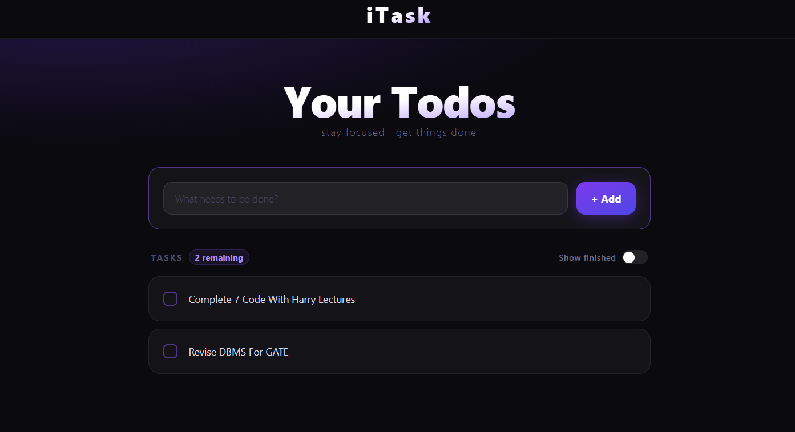
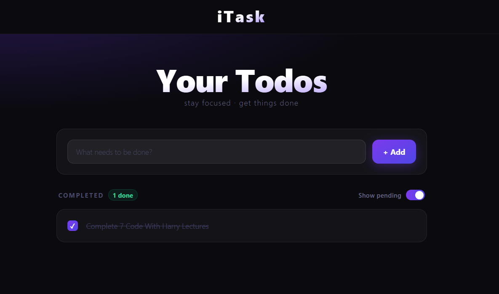

# ✦ iTask — Minimal Todo App

A clean, minimal, and fully responsive Todo application built with React and Tailwind CSS. Designed with a dark aesthetic and smooth interactions to keep you focused on what matters.

🌐**[View Live Demo](https://itask-todo.vercel.app)**

---

## ✨ Features

- Add, edit, and delete tasks
- Mark tasks as complete with a checkbox or double-click
- Toggle between pending and completed tasks
- Tasks persist across page refreshes using Local Storage
- Auto-capitalizes first letter of every task
- Press Enter to quickly add a task
- Remaining and completed task counters
- Fully responsive — works on mobile, tablet, and desktop

---

## 📸 Screenshots




---

## 🛠️ Tech Stack

- **React** — UI and state management
- **Tailwind CSS** — styling and responsive design
- **Vite** — development and build tool
- **Local Storage** — data persistence

---

## 🚀 Getting Started

```bash
# Clone the repository
git clone https://github.com/7Aryannn/itask.git

# Navigate to the project
cd itask

# Install dependencies
npm install

# Start the development server
npm run dev
```

---

## 📁 Project Structure

```
src/
├── components/
│   └── Navbar.jsx
├── App.jsx
├── main.jsx
└── index.css
```
